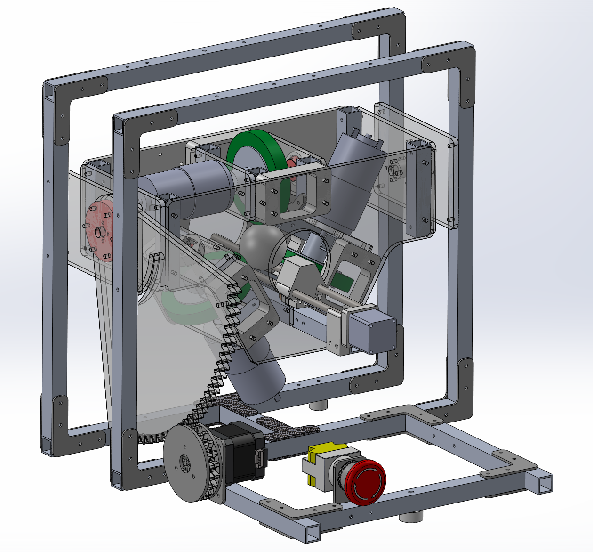
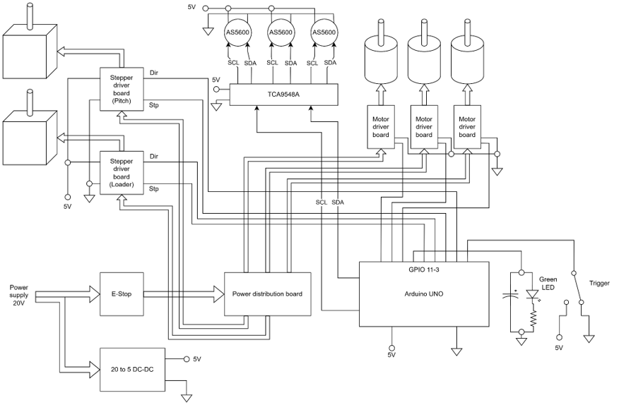
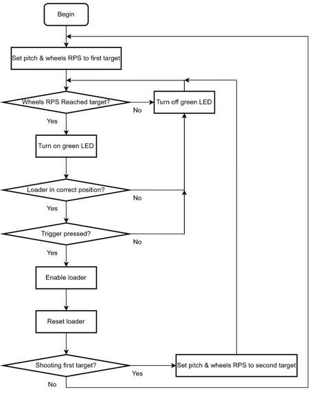

# Ball Shooting Machine – MECH3907 Group 7

> A three‑wheel table tennis ball launcher with automated aiming, speed control, and ball feeding.  
> Designed and built for the MECH3907 Mechatronic Design and Prototyping course at HKUST.

  

---

## Overview

This project is a **fully functional ball launching machine** that demonstrates mechatronic design principles — from mechanical construction to embedded control.  
It features:

- **Three‑wheel flywheel launch mechanism** for stable grip and high ball speed  
- **Pitch control** via stepper motor and sector gear (1:6 torque multiplication)  
- **Closed‑loop speed control** (PID) using AS5600 magnetic encoders  
- **Automatic ball feeder** with a linear stepper motor  
- **Pre‑programmed aiming** for targets at 2 m, 4 m, and 6 m (top/middle/bottom)  
- **Laser pointer** for visual alignment  
- **Safety interlocks** (LED status, loader position check, speed confirmation)

The machine was built on a budget of **~HK$500** and fits within a 400 mm × 400 mm footprint.

---

## Key Specifications

| Parameter                | Value                              |
|--------------------------|------------------------------------|
| **Power supply**         | 20 V DC (motors), 5 V (logic)     |
| **Power consumption**    | ~80 W                              |
| **Dimensions**           | 330 mm × 348 mm × 322 mm           |
| **Flywheel motors**      | 3× brushed DC (Model 799)          |
| **Pitch actuator**       | Stepper motor + 120‑tooth sector gear |
| **Ball feeder**          | 28‑step linear stepper + leadscrew |
| **Encoders**             | 3× AS5600 (magnetic, I²C)          |
| **Multiplexer**          | TCA9548A (for multiple I²C devices)|
| **Motor drivers**        | A4988 / DRV8825 (steppers), H‑bridge (DC) |
| **Microcontroller**      | Arduino UNO                        |
| **Material**             | Aluminium frame, acrylic housing, 3D‑printed parts |

---

## How It Works

1. **Setup** – The shooter is placed on the table. Pitch angle and flywheel speeds are selected via pre‑stored parameters in the Arduino code.
2. **Safety check** – The system verifies that the ball loader is retracted and that all three wheels have reached the target RPM (green LED = ready).
3. **Launch** – The feeder pushes the ball into the three‑wheel gap. The spinning PU wheels grip, compress, and accelerate the ball out.
4. **Closed‑loop control** – AS5600 encoders continuously report speed; PID adjusts PWM to maintain stable velocity.
5. **Automated targeting** – For competition, the machine alternates between middle and bottom targets at each distance without manual intervention.

---

## Mechanical Design Highlights

### Three‑Wheel Launching System
- Wheels arranged 120° apart for **symmetric grip** and minimal vertical drift.
- Polyurethane wheels deform to increase contact area and friction, maximising energy transfer.
- Upper wheel is fixed (after iterative removal of a tension spring) to ensure simultaneous contact with the lower pair.

### Frame & Housing
- **Aluminium base** – rigid and heavy to damp vibration and recoil.
- **Acrylic housing** – laser‑cut for fast prototyping; holds motors securely.

### Pitch Adjustment
- Stepper motor drives a 20‑tooth pinion engaging a 120‑tooth sector gear (ratio 1:6).
- High holding torque keeps the launcher stable at the desired angle.
- *Pitch motor behaved unstable. Please consider increasing the gear ratio.*

### Automatic Ball Feeder
- A linear stepper with leadscrew moves a 3D‑printed carriage smoothly forward to feed the ball.
- Returns to home position after each shot.

---

## Hardware & Software

### Electronics Layout
- **Main controller:** Arduino UNO
- **Power distribution:** 20 V → emergency stop → fused branches for each motor; 5 V for logic via DC‑DC converter.
- **I²C bus:** TCA9548A multiplexer to separate three AS5600 encoders (fixed address 0x36).
- **Motor drives:** Separate H‑bridge per flywheel motor for independent speed tuning.

  
### Software Features
- **PID control** on each flywheel for consistent RPM.
- **Low‑pass filtering** on encoder readings to reduce noise.
- **Safety workflow:** Green LED indicates ready; trigger disabled if loader not home or speeds not reached.
- **Pre‑programmed parameter sets** for different distances and target heights (angle, speed).

  

---

## Bill of Materials (BOM)

The final build cost was **~HK$500.76**.

*Full BOM with part numbers is available in ./Budget.xlsx.*

---

## Competition Results

In the final demonstration, we achieved:

| Distance | Score (best attempt) |
|----------|----------------------|
| 2 m      | 10 points (Bottom)   |
| 4 m      | 2 points (Bottom)    |
| 6 m      | –                     |

*Although the 6 m target proved challenging, the machine demonstrated consistent behaviour and reliable automation.*

---

## License

This project is **open‑source** and released under the **[Creative Commons Attribution‑NonCommercial 4.0 International License](https://creativecommons.org/licenses/by-nc/4.0/)**.

- You are free to **use, modify, and share** this project for **non‑commercial** purposes.
- ommercial use is **not permitted** without explicit permission.
- Please give appropriate credit to the original authors.

---

## Acknowledgements

- Inspired by the **AIMY** open‑source table tennis launcher (Max Planck Institute for Intelligent Systems) and the HKUST Robotics Team 2025 FDR1.
- Course instructors and lab technicians for guidance and facilities.
- Names of group members are removed from the reports to protect privacy.
  

---

## Contact

For questions or collaboration (non‑commercial), please open an issue or reach out via the repository.

---

**Enjoy building and shooting!**